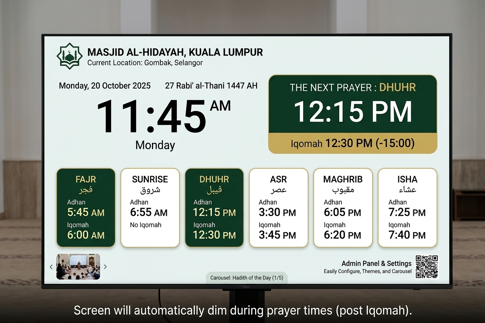

# Muhideen

Open-source masjid digital display system for mosques and suraus. Offline-first prayer times, Iqamah countdown, auto-dimming during prayer, and phone-friendly admin over LAN.

> Preview is non-binding. See `PRD.md` §0 for what is normative vs mockup.

## Status

In active development. Phase 1A (backend core) has landed: `core` vocabulary and ports, the pure `domain` state machine and fallback chain, the executable API contract (Pydantic DTOs, fixtures, OpenAPI), `engine` orchestration, SQLite persistence — WAL, hand-rolled migrations on `PRAGMA user_version`, the repository adapters (prayer/settings/display/user), 60s heartbeat batching, and `VACUUM INTO` backup — plus JAKIM e-solat sync with MABIMS calc fallback and scheduler, real HTTP handlers with SSE/auth/admin settings, and device integration (`muhideen`/`muhideen-seed` entrypoints, `install.sh`/`update.sh`, NTP health). Pending: the display/admin frontend (Phase 1B) and content/management (Phase 2) — see the milestone roadmap in [`PRD.md`](PRD.md) §9.

## What it will do

* JAKIM E-Solat sync by zone with cached fallback + on-device calculation (MABIMS live; MWL/ISNA/Egyptian are contract-named with behavior pending).
* Display: clock, Gregorian + Hijri dates, 5 prayer times (primary) + Imsak/Syuruq/Dhuha boundary markers (secondary), next-prayer hero, Iqamah countdown.
* Prayer state machine: `NORMAL → PRE_ADHAN → ADHAN → IQAMAH_COUNTDOWN → SALAH_DIM`.
* Carousel for announcements (auto-hidden around prayer), sandboxed community themes, display groups.
* Admin: setup wizard, mobile UI, QR fast-connect (`http://muhideen.local:8000/admin`), backup/restore.
* System: `muhideen.service` + Chromium kiosk + NTP health + optional HDMI-CEC.

Full requirements: [`PRD.md`](PRD.md).

## Tech stack

Python 3.11+ FastAPI-sync + Uvicorn 1 worker + SQLite WAL + Jinja2 + HTMX/Alpine.js + hand-written vanilla CSS. No Node, no build step. See `PRD.md` §4, `ARCHITECTURE.md`, and `docs/adr/0001-backend-stack.md`.

## Hardware

* Recommended all-in-one: Pi 4 2GB+ / Pi 5 / x86 thin client.
* Pi 3B+ degraded. Pi Zero 2 W thin-client or headless-server only, not all-in-one.
* Full kiosk budget: ≤1 GB with Chromium at 1080p. Backend only: ≤80 MB idle.

## Repo layout

* `PRD.md` — product requirements (normative).
* `ARCHITECTURE.md` — layers, ownership, enforcement.
* `CONTEXT.md` — domain glossary.
* `TESTING_STRATEGY.md` — test layers and commands.
* `CONTRIBUTING.md` — frontend-only / backend-only tracks.
* `docs/adr/` — accepted decisions. `docs/api-contract.md` — normative API.
* `api/fixtures/` — contract examples. Frontend builds against these.
* `src/muhideen/` — `core/ domain/ engine/ adapters/ api/ views/ migrations/`.
* `themes/classic-green/` — MVP theme scaffold. `tools/` — `mock_api.py`, `new_theme.py`, `lint_theme.py`.
* `preview.jpg` — non-binding display mockup.
* `install.sh` / `update.sh` / `packaging/` — device install and OTA update (`sudo ./install.sh --zone SGR01`); guide: `docs/deployment.md`.

## Contribute

Frontend-only: `uv run tools/mock_api.py` then build against `docs/api-contract.md`. Backend-only: `uv sync --all-extras` then `uv run pytest`. Full gate in `CONTRIBUTING.md`.

## License

MIT.
