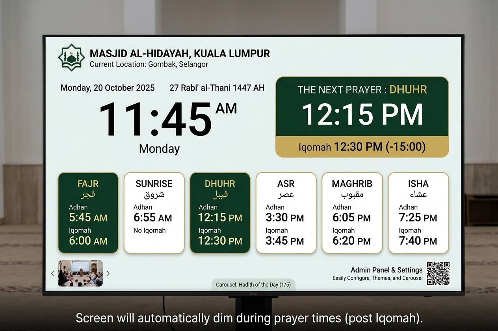

# Muhideen

Open-source masjid digital display system for mosques and suraus. Offline-first prayer times, Iqamah countdown, auto-dimming during prayer, and hand-edited JSON config with live reload.

> Preview is non-binding. See `PRD.md` §0 for what is normative vs mockup.

## Status

In active development. The backend serves prayer state from hand-edited JSON files: `core` vocabulary and ports, the pure `domain` state machine and fallback chain, the executable API contract (Pydantic DTOs, fixtures, OpenAPI), `engine` orchestration, file-backed settings/schedule repos with a ~1s hot-reload watcher — plus JAKIM e-solat sync with MABIMS calc fallback and scheduler, real HTTP handlers with SSE, and device integration (`muhideen` entrypoint, `install.sh`/`update.sh`, NTP health). There is no admin UI, no login, and no database. Pending: the display frontend refresh and content/management (Phase 2) — see the milestone roadmap in [`PRD.md`](PRD.md) §9.

## What it will do

* JAKIM E-Solat sync by zone with cached fallback + on-device calculation (MABIMS live; MWL/ISNA/Egyptian are contract-named with behavior pending).
* Display: clock, Gregorian + Hijri dates, 5 prayer times (primary) + Imsak/Syuruq/Dhuha boundary markers (secondary), next-prayer hero, Iqamah countdown.
* Prayer state machine: `NORMAL → PRE_ADHAN → ADHAN → IQAMAH_COUNTDOWN → SALAH_DIM`.
* Carousel for announcements (auto-hidden around prayer), sandboxed community themes, display groups.
* Admin: edit `config/muhideen.json` (copy from `config/muhideen.example.json`) — the watcher auto-reloads it in ~1s, no login. Per-display overrides (language, theme, dim, carousel) live in the `displays` map and render at `/display?id=<id>`.
* `config/prayer_buffer.json` is the machine-written timetable cache (manual-day pins outrank synced days) — don't hand-edit it; a missing file is just an empty cache.
* `media/` holds adhan audio (served at `/media/adhan.mp3`) plus playlist image files referenced by the config (template carousel rendering is a future slice).
* System: `muhideen.service` + Chromium kiosk + NTP health + optional HDMI-CEC.

Full requirements: [`PRD.md`](PRD.md).

## Tech stack

Python 3.11+ FastAPI-sync + Uvicorn 1 worker + JSON file config + Jinja2 display + hand-written vanilla CSS. No Node, no build step, no login, no database. See `PRD.md` §4, `ARCHITECTURE.md`, and `docs/adr/0001-backend-stack.md`.

## Hardware

* Recommended all-in-one: any Debian (Bookworm+) machine with 2GB+ RAM
  and a desktop UI for the kiosk browser / x86 thin client.
* Below 1GB RAM: thin-client or headless-server only, not all-in-one.
* Full kiosk budget: ≤1 GB with Chromium at 1080p. Backend only: ≤80 MB idle.

## Repo layout

* `PRD.md` — product requirements (normative).
* `ARCHITECTURE.md` — layers, ownership, enforcement.
* `CONTEXT.md` — domain glossary.
* `TESTING_STRATEGY.md` — test layers and commands.
* `CONTRIBUTING.md` — frontend-only / backend-only tracks.
* `docs/adr/` — accepted decisions. `docs/api-contract.md` — normative API.
* `api/fixtures/` — contract examples. Frontend builds against these.
* `src/muhideen/` — `core/ domain/ engine/ adapters/ api/ views/` (file config, no persistence layer).
* `config/muhideen.example.json` — golden config: copy to `muhideen.json` and edit for your masjid.
* `themes/classic-green/` — MVP theme scaffold. `tools/` — `mock_api.py`, `new_theme.py`, `lint_theme.py`.
* `preview.jpg` — non-binding display mockup.
* `install.sh` / `update.sh` / `packaging/` — device install and OTA update (`sudo ./install.sh` installs the example config when missing, then serve with `--config`); guide: `docs/deployment.md`.

## Contribute

Frontend-only: `uv run tools/mock_api.py` then build against `docs/api-contract.md`. Backend-only: `uv sync --all-extras` then `uv run pytest`. Full gate in `CONTRIBUTING.md`.

## License

MIT.
