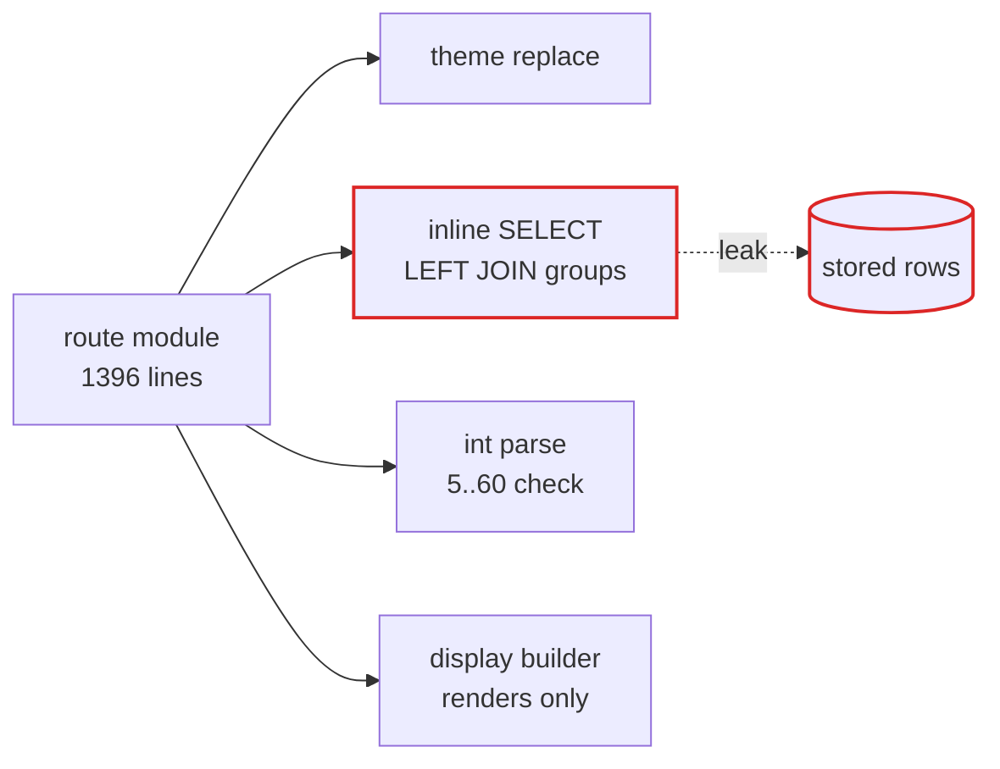
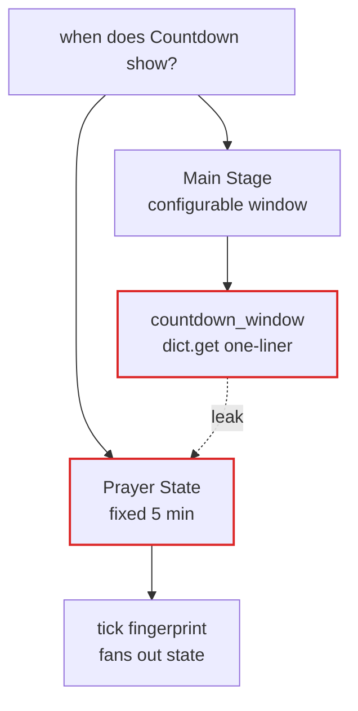
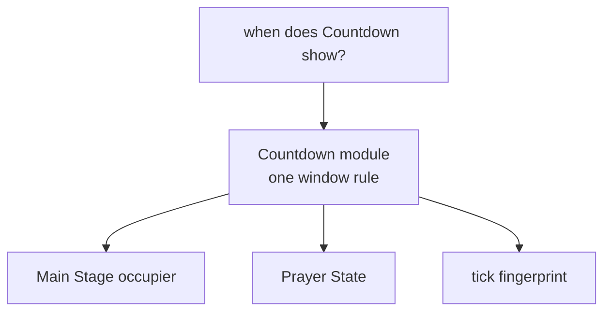

# Architecture review — muhideen

Date: 2026-09-30 · Hot spots: display render, Prayer State, Fallback Chain, Playlist, settings knobs

Source: `/tmp/architecture-review-20260930-220446.html` (visual report with side-by-side before/after diagrams).

Legend: solid box = module · dashed = seam · red = leakage across the seam · dark box = deep module.

> Vocabulary follows `CONTEXT.md` for domain terms and the codebase-design glossary for architecture terms: module, interface, implementation, depth, deep, shallow, seam, adapter, leverage, locality.

## 1. Deepen the Dim precedence module

- Recommendation: **Strong** · `ports & adapters`
- Files: `src/muhideen/api/app.py:622–739` · `src/muhideen/adapters/sqlite_repo.py` · `src/muhideen/views/display.py:102–199`

**Problem:** The route module is shallow on Dim: three-tier precedence spelled inline as stored-row reads plus string parsing.

**Solution:** Deepen one Dim module behind a narrow seam owning precedence, parsing, and range rule.

Before — precedence inline in route module:

- inline SELECT in handler, `app.py:670–676`
- int parse + range check in handler, `app.py:680–688`
- display pin, group pin, settings default — no owning module

After — one deep Dim module with narrow seam `effective_dim(id)`:

- stored-row reads, parsing, range rule hidden inside
- invalid row maps to typed slate reason
- route module keeps: load settings, ask Dim module, render

Wins:

- locality: Dim defects concentrate in one module
- leverage: one seam, every render reuses it
- tests hit one seam, not seeded rows
- implementation absorbs the inline SELECT

ADR note: aligns with ADR-0003 — persistence belongs behind repository ports; the inline SELECT restores that violation.

## 2. Unify the Iqamah label seam

- Recommendation: **Strong** · `in-process`
- Files: `src/muhideen/views/display.py:66–84` · `src/muhideen/domain/iqamah.py:16–40` · `src/muhideen/domain/prayer_state.py`

**Problem:** Per-card Iqamah labels re-implement delay-vs-fixed semantics inside the display module.

**Solution:** Deepen the Prayer Time Marker module: compute labels once upstream, carry them through the Contract.

Before — same rule twice, no shared seam:

- display builder never imports domain (enforced seam)
- domain `resolve_iqamah`: delay, fixed, midnight guard
- display `_iqamah_hhmm`: delay, fixed, no guard
- semantics leak across the seam while types do not · comment at `display.py:69` admits the mirror

After — labels computed once, carried by Contract:

- Prayer Time Marker module stays sole owner
- Contract carries iqamah HH:MM per card
- display builder renders strings, computes nothing
- one implementation · display module gains depth by deleting logic · no import crosses the seam

Wins:

- locality: midnight fix lands once, fixed everywhere
- interface shrinks; display module stops computing
- one test pins both readers agree
- deletion test: mirror deletes, depth concentrates

ADR note: respects ADR-0002 (Contract is sole coupling between tracks) · importing domain into the display module would contradict ADR-0002.

## 3. Collapse the Countdown window split

- Recommendation: **Strong** · `in-process`
- Files: `src/muhideen/domain/countdown.py:13–17` · `src/muhideen/domain/prayer_state.py:23,168` · `src/muhideen/domain/stage.py:126–171` · `src/muhideen/engine/engine.py:100–139`

**Problem:** Countdown takeover and PRE_ADHAN disagree on source: configurable minutes versus hardcoded five.

**Solution:** Deepen one Countdown module behind a single seam read by Main Stage and Prayer State.

Before — two windows, one visible moment:

- pure functions tested; the call sequence is not

After — one Countdown module owns the window:

- shallow dict.get absorbed · both readers use the same seam

Wins:

- locality: window defects concentrate in one module
- leverage: one seam, two readers plus tick
- delete shallow one-liner modules
- call-sequence tests replace isolated tests

## 4. Parse the Playlist window grammar once

- Recommendation: **Worth exploring** · `in-process`
- Files: `src/muhideen/core/values.py:326–354` · `src/muhideen/api/app.py:148–234,977–1029` · `src/muhideen/domain/stage.py:68–124` · `src/muhideen/adapters/playlist_repo.py:22–62`

**Problem:** The Playlist window language is validated in the route module and re-parsed in the Main Stage module.

**Solution:** Deepen the Playlist module: parse at the seam into a typed window; resolution never parses.

Before — checked at write, re-parsed at resolve:

- route module: regex + marker lookup + rejection of informational anchors
- adapter: verbatim string round-trip, no check
- Main Stage: second split + error inside resolve loop
- preview: 288-sample loop with own day cache

After — typed window, preview reuses live seam:

- Playlist module parses once at the seam, stores typed window, rejects informational anchors once
- Main Stage resolves typed windows, never parses
- preview samples through the same tick seam

Wins:

- locality: grammar drift becomes impossible
- interface shrinks; raw strings stop round-tripping
- preview shares the live tick seam
- tests pin one grammar, not two

## 5. Collapse the Settings knob sprawl

- Recommendation: **Worth exploring** · `local-substitutable`
- Files: `src/muhideen/core/values.py:174–301` · `src/muhideen/api/dto.py:317–431` · `src/muhideen/adapters/sqlite_repo.py:177–360` · `src/muhideen/views/display.py:149–199` · `src/muhideen/static/admin.js`

**Problem:** Each knob is a shallow pass-through copied across value, wire, stored-row, display, and script modules.

**Solution:** Deepen the Settings module into the single owner of defaults and closed-enum rules.

Before — interface as wide as implementation:

- interface: 20+ fields · copies field by field · script mirror DEFAULTS
- one knob touches 6 places · closed enums spelled 4 times · script drift untested

After — single owner of defaults:

- interface narrows · implementation owns defaults plus mapping
- Settings module deepens · wire plus stored-row mapping read from one seam

Wins:

- locality: enum fixes land once
- leverage: one seam feeds wire plus rows
- interface shrinks; mappers move inside
- script defaults tested against the seam

## Top recommendation

**1. Deepen the Dim precedence module** — every future display and Theme change pays this tax, and Dim is solemn-mode correctness.

Smallest seam move with the largest locality gain: lift precedence, parsing, and range rule out of the 1396-line route module into one tested seam. Next: **2. Unify the Iqamah label seam**, the cheapest deletion-test win.
